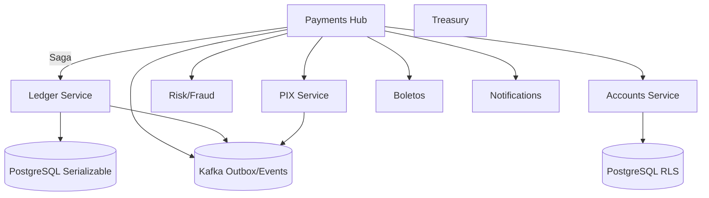

### C4 – Contêineres (núcleo financeiro)

```mermaid
graph TD
  Payments[Payments Hub]
  Ledger[Ledger Service]
  Accounts[Accounts Service]
  Risk[Risk/Fraud]
  PIX[PIX Service]
  Boletos[Boletos]
  Treasury[Treasury]
  Notifications[Notifications]

  Payments -->|Saga| Ledger
  Payments --> Risk
  Payments --> Accounts
  Payments --> PIX
  Payments --> Boletos
  Payments --> Notifications
  Ledger --> PGCore[(PostgreSQL Serializable)]
  Accounts --> PGOps[(PostgreSQL RLS)]
  Payments --> Kafka[(Kafka Outbox/Events)]
  Ledger --> Kafka
  PIX --> Kafka
```

